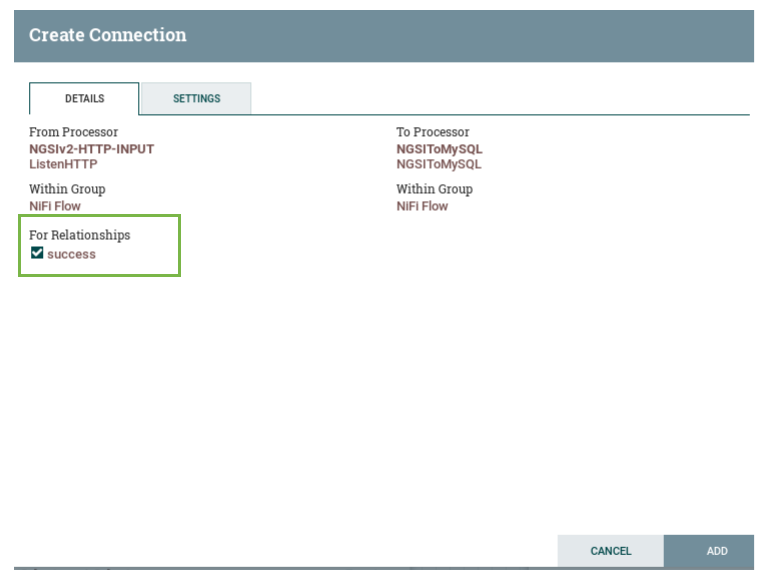
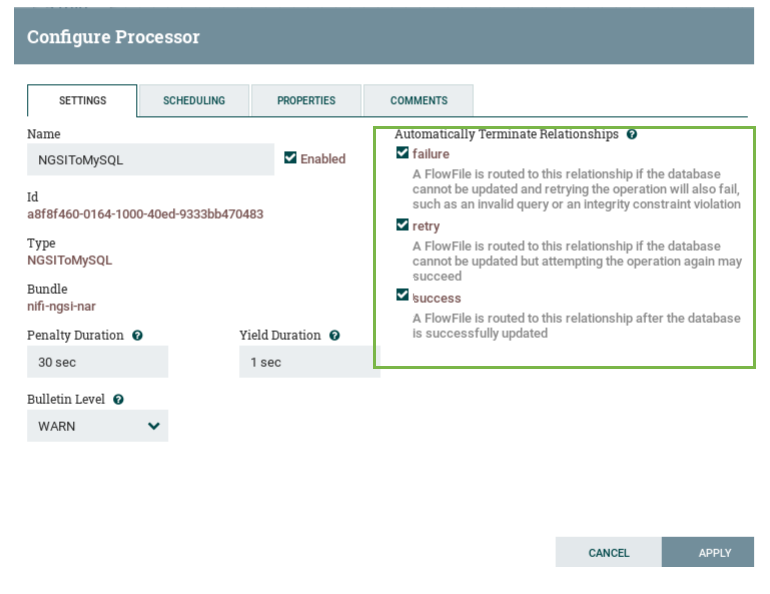
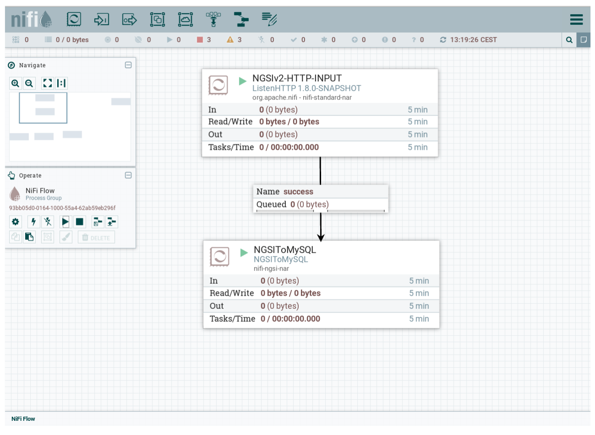

## Connecting processors

In the previous sections we explained how to configure the controller and processors.
Now we have to connect the source processor (Listen HTTP processor) and the sinks
( NGSIToMySQL, NGSIToPostgreSQL, NGSIToMongo ).

In the [Cygnus GUI](./cygnus_gui.md) section we explain the concept of connection 
and how you can connect the the processor between them. Please follow the steps for
connection the Listen HTTP and NGSIToMySQL processors.

Once you connect those to processors a popup window will be displayed show that 
the processor between them are connected by a success relationship because the Listen HTTP processor 
only can be connected by success relationship.

However, the others NGSI (NGSIToMySQL, NGSIToPostgreSQL, NGSIToMongo) processors has at least
three relationships: success, failure, and retry, if you are not going to 
connect those processor with others using that relation please set them
to auto-terminate.

That is all you need to do before start the processors and start to 
receive data. 

Now you can start your processors by selecting them and clicking in the Play button in the Operate pallet.
At the end, you should have a similar deployment like the next figure.

 
If you want to avoid a wide part of the configuration process
you can use the templates provided with this Cygnus distribution. For more info 
please go to the [Templates](./templates-cygnus.md) Section. Also you can set test your 
deployment following the [Quick Start Guide](../quick_start_guide.md)

Moreover for specific information about the  and all the properties 
and database structures please go to the [Processors Catalogue Section](../processors_catalogue/README.md).