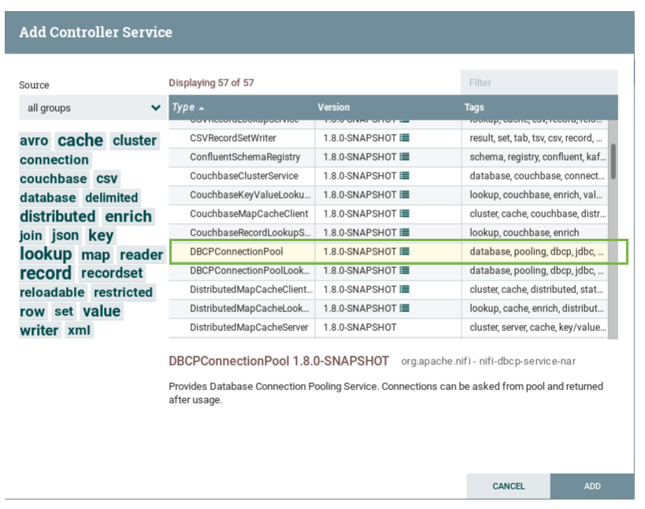
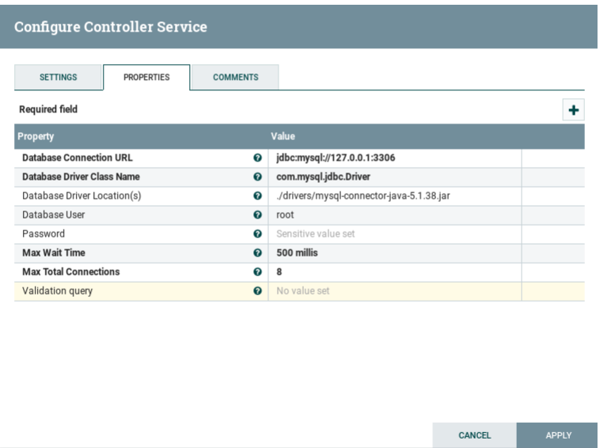
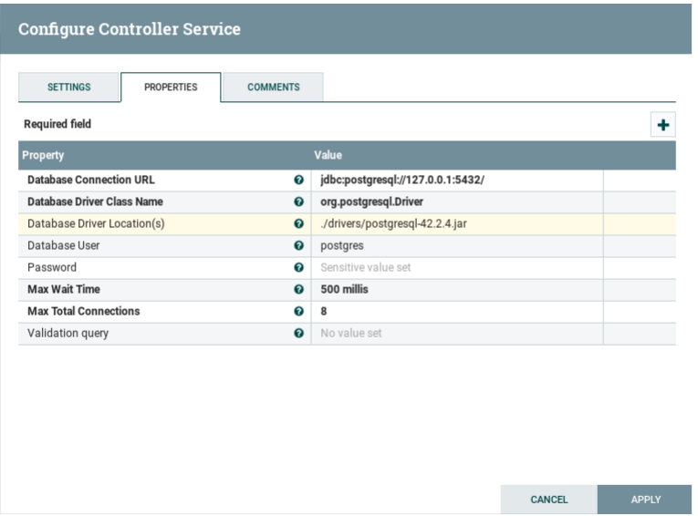

## Controllers configuration

Controllers play an important role in Cygnus. It component is in charge of manage
all the functions needed for using different data storage. In our case we use controllers
for establish and configure the connection between the cygnus and third party storage.

As we listed in the beginning of the documentation Cygnus is intended to be used 
for ingesting NGSI events to some sinks using the NGSI standard for managing context information.
The current version of cygnus is able to persist data inthe following DB's:

* MySQL (using the DBCPConnectionPoll controller).
* PostgreSQL (using the DBCPConnectionPoll controller).
* MongoDB (configured directly into the Processor).

As you can see MySQL and PostgreSQL needs to use the DBCPConnectionPoll controller and in 
order to work with it we will explain how that controller needs to be configured.

First, follow the steps in [Cygnus GUI](./cygnus_gui.md) for adding a new controller.
In the add controller page, select the DBCPConnectionPoll controller

Now Click on the configuration button of the DBCPConnectionPool controller and go the the properties Tab.

This version of Cygnus, includes a drivers folder with the drivers for
MySQL and PostgreSQL and also a templates folder with preconfigured values for each controller.

### MySQL specific configuration

The next figure show the values that you need to put for configuring the DBCPConnectionPoll controller
for persisting NGSI events to MySQL.

Database Connection URL 
    
    jdbc:mysql://<mysql-host-ip>:<mysql-port>
    jdbc:mysql://127.0.0.1:3306

Database Driver Class Name

    com.mysql.jdbc.Driver

Database Driver Location(s)

    ./drivers/mysql-connector-java-5.1.38.jar

Database User (full grant user)

    root

Password
    
    <your-password>
    
Max Wait Time

    500 millis

Max Total Connections

    8

### PostgreSQL Specific configuration
The next figure show the values that you need to put for configuring the DBCPConnectionPoll controller
for persisting NGSI events to PostgreSQL.

Database Connection URL

    jdbc:postgresql://<postgresql-host-ip>:<postgresql-port>
    jdbc:postgresql://127.0.0.1:5432/

Database Driver Class Name

    org.postgresql.Driver

Database Driver Location(s)

    ./drivers/postgresql-42.2.4.jar

Database User (full grant user)

    postgres

Password

    <your-password>

Max Wait Time

    500 millis

Max Total Connections

    8
    

For the DBCPConnectionPoll a list with all the parameters and his description is provided below, the names of required properties appear in bold. Any other properties (not in bold) are considered optional. The table also indicates any default values, whether a property supports the NiFi Expression Language, and whether a property is considered "sensitive", meaning that its value will be encrypted. Before entering a value in a sensitive property, ensure that the nifi.properties file has an entry for the property nifi.sensitive.props.key.

|Name|Default Value|Allowable Values|Description|
|--- |--- |--- |--- |
|**Database Connection URL**| | |A database connection URL used to connect to a database. May contain database system name, host, port, database name and some parameters. The exact syntax of a database connection URL is specified by your DBMS.Supports Expression Language: true (will be evaluated using variable registry only)|
|**Database Driver Class Name**| | |Database driver class nameSupports Expression Language: true (will be evaluated using variable registry only)|
|**Database Driver Location(s)**| | |Comma-separated list of files/folders and/or URLs containing the driver JAR and its dependencies (if any). For example '/var/tmp/mariadb-java-client-1.1.7.jar'Supports Expression Language: true (will be evaluated using variable registry only)|
|Database User| | | Database user nameSupports Expression Language: true (will be evaluated using variable registry only)|
|Password| | |The password for the database userSensitive Property: trueSupports Expression Language: true (will be evaluated using variable registry only)|
|**Max Wait Time**|500 millis| |The maximum amount of time that the pool will wait (when there are no available connections)  for a connection to be returned before failing, or -1 to wait indefinitely.|
|**Max Total Connections**|8| |The maximum number of active connections that can be allocated from this pool at the same time,  or negative for no limit.|
|Validation query| | |Validation query used to validate connections before returning them. When connection is invalid, it get's dropped and new valid connection will be returned. Note!! Using validation might have some performance penalty.Supports Expression Language: true (will be evaluated using variable registry only)|

### MongoDB Specific configuration

MongoDB doesn't need a controller configuration, instead all of that configuration is done directly in the processor [NGSIToMongo](../processors_catalogue/NGSIToMongo.md).

